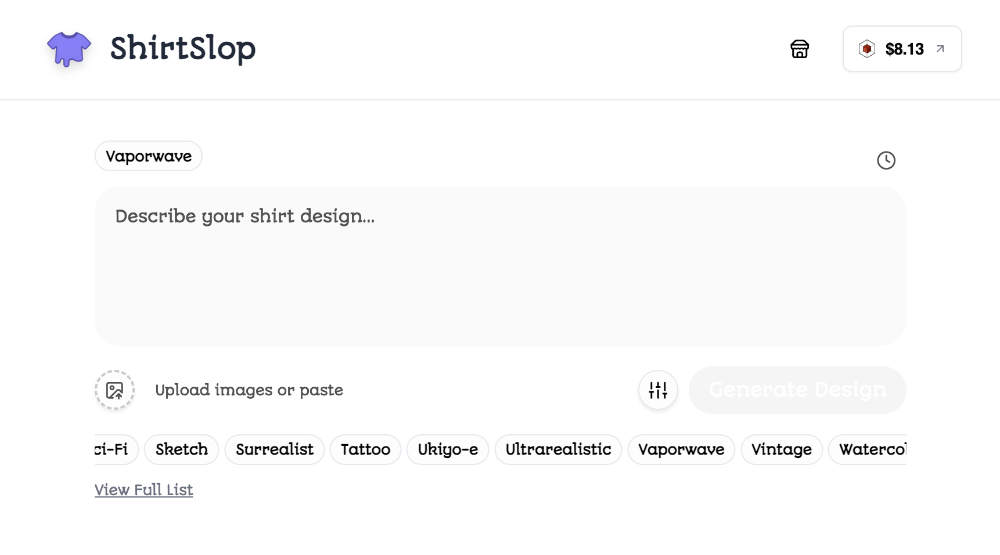
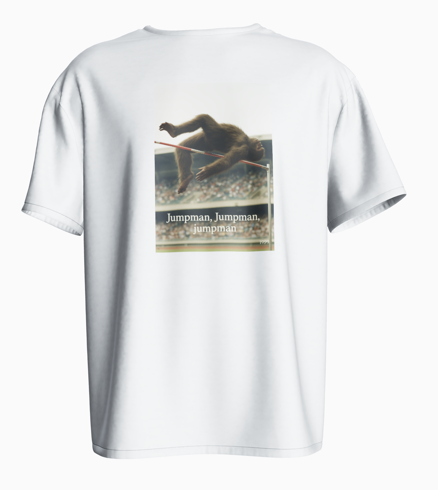

# [ShirtSlop.com](https://www.shirtslop.com/)

AI-powered shirt design generator that creates custom graphics for your t-shirts and hosts on Shopify.

The app generates a design based on your description, displays on a customizable 3D shirt model and (optionally) publishes to Shopify for sharing.

Generate your own slop at [ShirtSlop.com](https://www.shirtslop.com).

## Contributing
ShirtSlop is built on [Echo](echo.merit.systems). 
- Every AI generation **pays the devs.**
- Every T-Shirt purchased **pays the devs.**

Details at [terminal.merit.systems/rsproule/shirtslop](terminal.merit.systems/rsproule/shirtslop).

## Features

- AI-powered image generation
- 3D shirt preview
- Prompt history
- Design history
- Multiple shirt colors
- Texture placement options (front/back/full)

## Dev

1. Install dependencies: `pnpm install`
2. Start development server: `pnpm dev`
3. Open http://localhost:5173